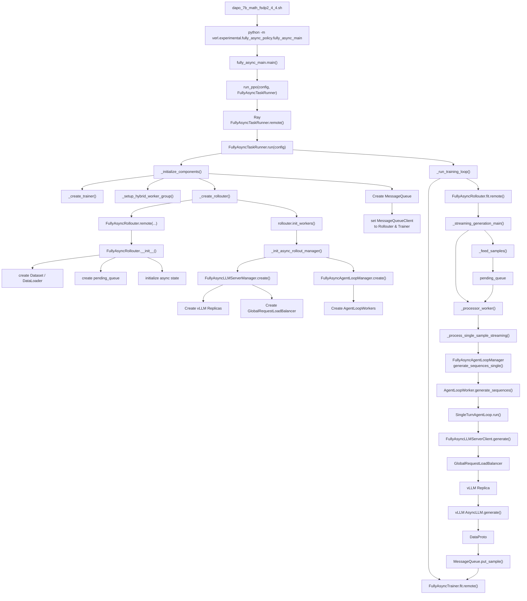

```mermaid
flowchart TD
    A["dapo_7b_math_fsdp2_4_4.sh"]
    --> B["python -m verl.experimental.fully_async_policy.fully_async_main"]

    B --> C["fully_async_main.main()"]
    C --> D["run_ppo(config, FullyAsyncTaskRunner)"]

    D --> E["Ray<br/>FullyAsyncTaskRunner.remote()"]
    E --> F["FullyAsyncTaskRunner.run(config)"]

    F --> G["_initialize_components()"]

    G --> G1["_create_trainer()"]
    G --> G2["_setup_hybrid_worker_group()"]
    G --> G3["_create_rollouter()"]

    G3 --> H["FullyAsyncRollouter.remote(...)"]
    H --> I["FullyAsyncRollouter.__init__()"]

    I --> I1["create Dataset / DataLoader"]
    I --> I2["create pending_queue"]
    I --> I3["initialize async state"]

    G3 --> J["rollouter.init_workers()"]

    J --> J1["_init_async_rollout_manager()"]
    J1 --> J2["FullyAsyncLLMServerManager.create()"]
    J2 --> J3["Create vLLM Replicas"]
    J2 --> J4["Create GlobalRequestLoadBalancer"]

    J1 --> J5["FullyAsyncAgentLoopManager.create()"]
    J5 --> J6["Create AgentLoopWorkers"]

    G --> K["Create MessageQueue"]
    K --> K1["set MessageQueueClient<br/>to Rollouter & Trainer"]

    F --> L["_run_training_loop()"]

    L --> M["FullyAsyncRollouter.fit.remote()"]
    L --> N["FullyAsyncTrainer.fit.remote()"]

    M --> O["_streaming_generation_main()"]
    O --> P["_feed_samples()"]
    O --> Q["_processor_worker()"]

    P --> R["pending_queue"]
    R --> Q

    Q --> S["_process_single_sample_streaming()"]
    S --> T["FullyAsyncAgentLoopManager<br/>generate_sequences_single()"]

    T --> U["AgentLoopWorker.generate_sequences()"]
    U --> V["SingleTurnAgentLoop.run()"]
    V --> W["FullyAsyncLLMServerClient.generate()"]

    W --> X["GlobalRequestLoadBalancer"]
    X --> Y["vLLM Replica"]
    Y --> Z["vLLM AsyncLLM.generate()"]

    Z --> AA["DataProto"]
    AA --> AB["MessageQueue.put_sample()"]
    AB --> N
```
