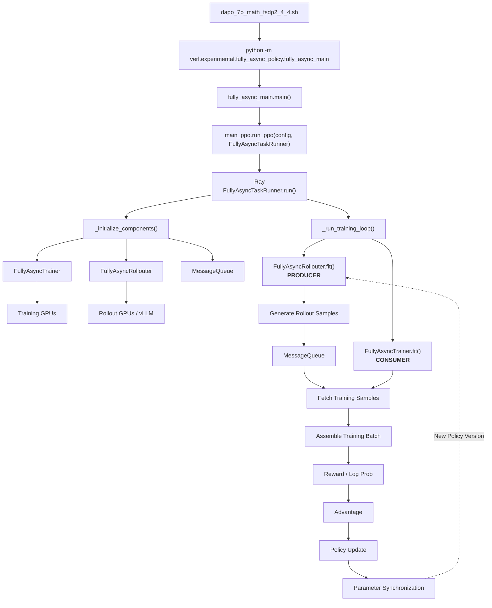
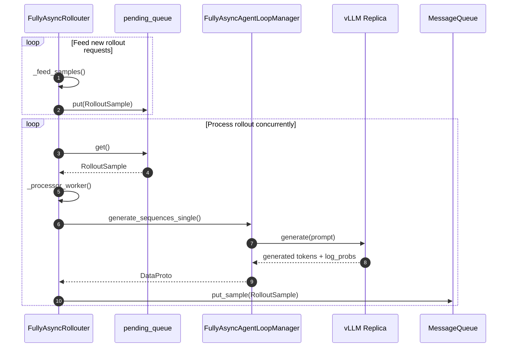
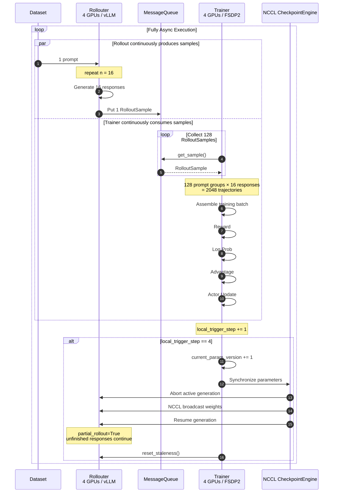

# 深入 verl Fully Async Training：从架构原理到 AMD ROCm 上的 DAPO 训练实践

我们从 [dapo_7b_math_fsdp2_4_4.sh](https://github.com/Vivicai1005/verl/blob/main/verl/experimental/fully_async_policy/shell/dapo_7b_math_fsdp2_4_4.sh)出发，沿着实际代码调用链去分析verl Fully Async Training的工作流程，并进一步理解rollout, training, sample queue 以及 parameter synchronization 是如何解耦并异步运行的。

整体调用链可以先概括为：

<details>
<summary>fully_async_main.py中main()代码</summary>
    
```python 
@hydra.main(config_path="config", config_name="fully_async_ppo_trainer", version_base=None)
def main(config):
    from verl.trainer.main_ppo import run_ppo

    # Ensure async training config exists
    if not hasattr(config, "async_training"):
        raise RuntimeError("must set async_training config")

    from time import time

    start_time = time()
    auto_set_device(config)
    # TODO: unify rollout config with actor_rollout_ref
    config.actor_rollout_ref.rollout.nnodes = config.rollout.nnodes
    config.actor_rollout_ref.rollout.n_gpus_per_node = config.rollout.n_gpus_per_node
    config = migrate_legacy_reward_impl(config)
    run_ppo(config, task_runner_class=FullyAsyncTaskRunner)
    print(f"total time: {time() - start_time:.2f} seconds")
```
</details>

## FullyAsyncTaskRunner
### `run_ppo`：启动 FullyAsyncTaskRunner
`fully_async_main.main()` 主要完成 Hydra 配置加载、device 配置以及部分 rollout 配置迁移，通过：
```python
run_ppo(config, task_runner_class=FullyAsyncTaskRunner)
```
启动 `FullyAsyncTaskRunner`。因此，如果把前面的 `main()` 看作 Fully Async Training 的入口，那么 `FullyAsyncTaskRunner` 就是整个 Fully Async 系统的顶层调度器。

### `FullyAsyncTaskRunner.run()`
```python
def run(self, config):
    self._initialize_components(config)
    self._run_training_loop()
```
整个Fully Async 系统分成两个阶段:
(1) `__initialize_components()`: 负责创建Trainer, Rollouter, AgentLoopManager, vLLM Replicas, MessageQueue, Checkpoint Manager。
(2) `_run_training_loop()`: Rollouter.fit() 和 Trainer.fit()

## FullyAsyncRollouter
在FullyAsyncTaskRunner `_initialize_components()` 中的 `_create_rollouter` 创建 Rollouter
```python
rollouter = FullyAsyncRollouter.remote(
    config=config,
    tokenizer=self.components["tokenizer"],
    processor=self.components["processor"],
    device_name=config.trainer.device,
)
```

FullyAsyncRollouter的数据流如下：



> [!TIP]
> **Producer-Consumer**
>
> 生产者-消费者模式 （Producer-Consumer Pattern） 是一种经典的并发设计模式，用于解决两个处理速率不一致的组件之间的数据传输问题。
>
> - **核心思想**：生产者 （Producer） 和消费者 （Consumer）并不直接通信，而是通过一个 缓冲区 （Buffer/Queue）进行解耦。
> - **Producer**：负责生成数据，并将其放入缓冲区。如果缓冲区满了，生产者必须等待或丢弃数据。
> - **Consumer**：负责从缓冲区取出数据进行处理。如果缓冲区空了，消费者必须等待。
> - **Buffer**：平滑了生产和消费的速率波动，允许两者并行工作，互不阻塞。

`FullyAsyncRollouter` 是 Fully Async Training 中的 rollout producer。它持续从训练数据集中读取prompt，将 rollout request 放入内部 `pending_queue`，随后由独立的 processor coroutine 从 `pending_queue` 中读取这些 request，并异步提交给 rollout inference engine。

### Init
(1) 校验 Fully Async 配置
```python
assert not self.hybrid_engine
assert self.config.data.train_batch_size == 0
assert self.config.data.gen_batch_size == 1
assert self.config.async_training.staleness_threshold >= 0
assert self.config.async_training.trigger_parameter_sync_step >= 1
```
Fully Async Rollouter 以 single sample 为单位不断提交 rollout，而不是先组织完整 rollout batch 再统一生成。

(2) 创建 Dataset 和 DataLoader
Fully Async 架构中 Rollouter 自己维护 rollout 数据源。
```python
train_dataset = create_rl_dataset(...)
val_dataset = create_rl_dataset(...)
train_sampler = create_rl_sampler(...)
...
self._create_dataloader(
    train_dataset,
    val_dataset,
    collate_fn,
    train_sampler,
)
```

### pending_queue
### FullyAsyncAgentLoopManager
### LLMServer

## FullyAsyncTrainer

## MessageQueue



