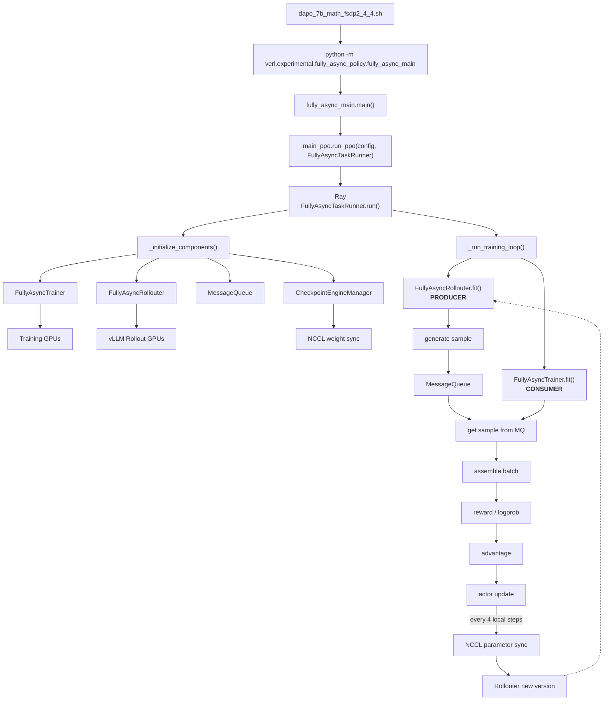
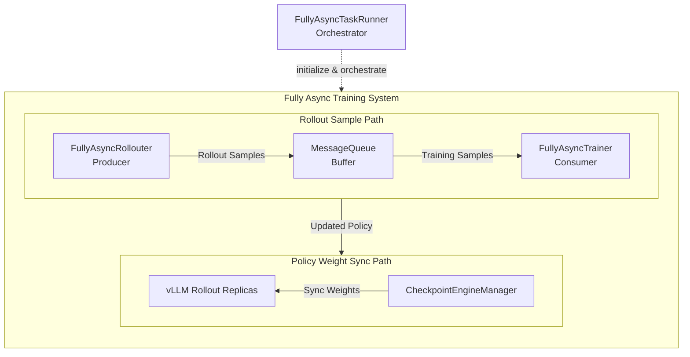
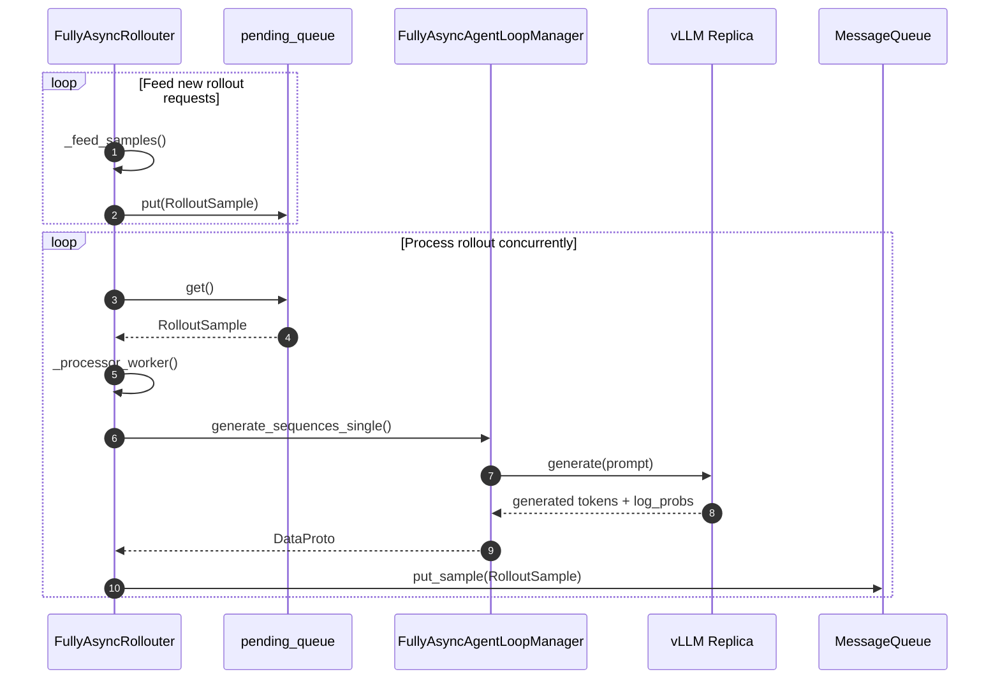
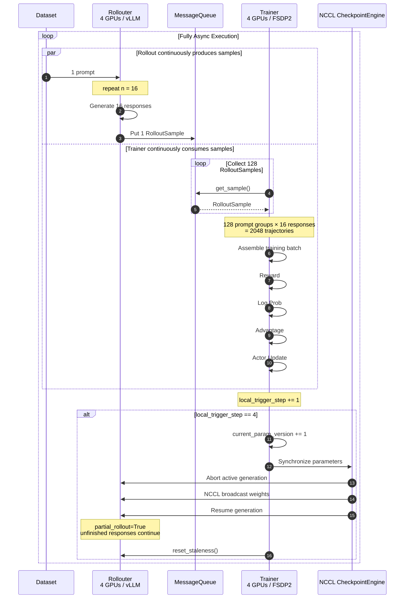

# 深入 verl Fully Async Training：从架构原理到 AMD ROCm 上的 DAPO 训练实践

从 `dapo_7b_math_fsdp2_4_4.sh`去理解verl fully async的工作流


## FullyAsyncTaskRunner
```
dapo_7b_math_fsdp2_4_4.sh
        │
        ▼
python -m verl.experimental.fully_async_policy.fully_async_main
        │
        ▼
main(config)
        │
        ▼
run_ppo(config, FullyAsyncTaskRunner)
        │
        ▼
FullyAsyncTaskRunner.run(config)
```
<details>
<summary>fully_async_main.py中main()代码</summary>
    
```python 
@hydra.main(config_path="config", config_name="fully_async_ppo_trainer", version_base=None)
def main(config):
    from verl.trainer.main_ppo import run_ppo

    # Ensure async training config exists
    if not hasattr(config, "async_training"):
        raise RuntimeError("must set async_training config")

    from time import time

    start_time = time()
    auto_set_device(config)
    # TODO: unify rollout config with actor_rollout_ref
    config.actor_rollout_ref.rollout.nnodes = config.rollout.nnodes
    config.actor_rollout_ref.rollout.n_gpus_per_node = config.rollout.n_gpus_per_node
    config = migrate_legacy_reward_impl(config)
    run_ppo(config, task_runner_class=FullyAsyncTaskRunner)
    print(f"total time: {time() - start_time:.2f} seconds")
```
</details>



Ray 是一个统计计算框架，旨在实现简单地从单机到大型分布式集群的扩展，提供构建和运行分布式应用的底层基础设置和一组核心原语。
Ray Task 是 Ray 中最基本的计算单元，代表一个无状态的远程函数。Ray Task的每次执行都是独立的，不保留之前的任何信息。就像调用一个普通函数，执行完就清除内部状态。我们调用一个 Ray Task 后，会立即返回得到一个Ray ObjectRef，而不是实际的结果。主程序可以继续执行其他操作，而 Ray Task 则在后台并行运行。我们需要使用ray.get() 来获取Task的实际结果。Ray Task非常适合并行执行大量独立、一次性的计算任务，譬如数据批处理、独立的模型推理等场景。

Fully Async的初始化主要由 `FullyAsyncTaskRunner._initialize_components()` 完成。 `main()`首先通过Hydra加载并合并训练配置，设置运行设备，然后调用通用的`run_ppo()` 初始化Ray,并启动一个 `FullyAsyncTaskRunner` Ray Actor,; TaskRunner 随后负责真正构建 Fully Async 训练系统。 

FullyAsyncRunner 初始化 `FullyAsyncTrainer` 和 `FullyAsyncRollouter`: Trainer 管理 Actor, Reference 等训练侧 Worker, 并负责消费rollout sample, 计算 advantage 和更新 policy; Rollouter 管理独立的 rollout GPU 和异步推理引擎，负责持续生成 trajectory。初始化 Trainer 前，会先通过 `create_role_worker_mapping()` 确定不同 Role 对应的 Worker 类型和 WorkerGroup 实现，并通过 ResourcePool 将 Trainer 的 Worker 分配到对应的 GPU 资源上。

Trainer 和 Rollouter 创建完成之后，`fully_async_main.py` 会进一步建立两条关键通信路径。第一条是 sample data path: 创建一个共享的 `MessageQueue`，并把同一个 `MessageQueueClient` 注入 Trainer 和 Rollouter。


## FullyAsyncRollouter

FullyAsyncRollouter的数据流如下：

> [!TIP]
> **Producer-Consumer**
>
> 生产者-消费者模式 （Producer-Consumer Pattern） 是一种经典的并发设计模式，用于解决两个处理速率不一致的组件之间的数据传输问题。
>
> - **核心思想**：生产者 （Producer） 和消费者 （Consumer）并不直接通信，而是通过一个 缓冲区 （Buffer/Queue）进行解耦。
> - **Producer**：负责生成数据，并将其放入缓冲区。如果缓冲区满了，生产者必须等待或丢弃数据。
> - **Consumer**：负责从缓冲区取出数据进行处理。如果缓冲区空了，消费者必须等待。
> - **Buffer**：平滑了生产和消费的速率波动，允许两者并行工作，互不阻塞。

`FullyAsyncRollouter` 是 Fully Async Training 中的 rollout producer。它持续从训练数据集中读取prompt，将rollout request放入内部 `pending queue`


## FullyAsyncTrainer

## MessageQueue



