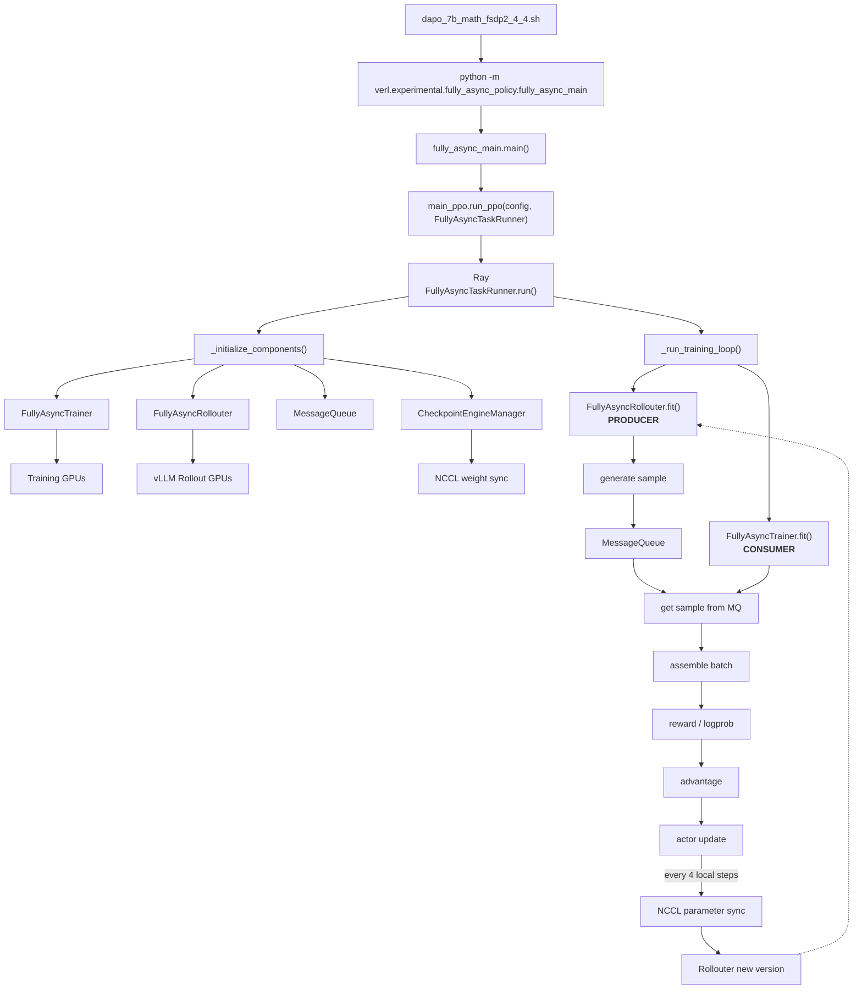
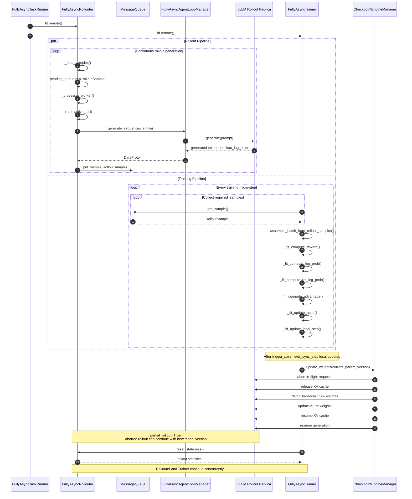
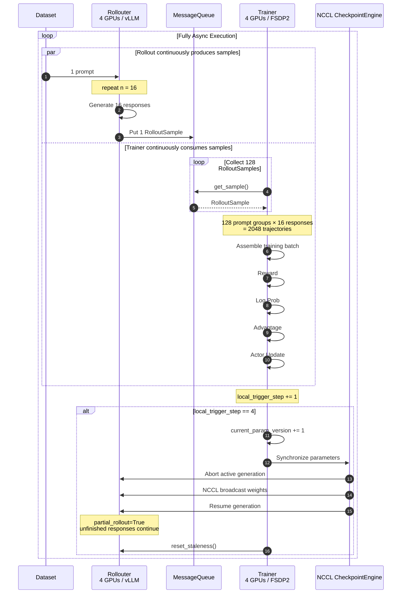

```mermaid
flowchart TD
    A["dapo_7b_math_fsdp2_4_4.sh"]
    --> B["python -m verl.experimental.fully_async_policy.fully_async_main"]

    B --> C["fully_async_main.main()"]

    C --> D["main_ppo.run_ppo(config, FullyAsyncTaskRunner)"]

    D --> E["Ray<br/>FullyAsyncTaskRunner.run()"]

    E --> F["_initialize_components()"]

    F --> F1["FullyAsyncTrainer"]
    F1 --> F11["Training GPUs"]

    F --> F2["FullyAsyncRollouter"]
    F2 --> F21["vLLM Rollout GPUs"]

    F --> F3["MessageQueue"]

    F --> F4["CheckpointEngineManager"]
    F4 --> F41["NCCL weight sync"]

    E --> G["_run_training_loop()"]

    G --> R["FullyAsyncRollouter.fit()<br/><b>PRODUCER</b>"]
    G --> T["FullyAsyncTrainer.fit()<br/><b>CONSUMER</b>"]

    R --> R1["generate sample"]
    R1 --> MQ["MessageQueue"]

    MQ --> T1["get sample from MQ"]

    T --> T1
    T1 --> T2["assemble batch"]
    T2 --> T3["reward / logprob"]
    T3 --> T4["advantage"]
    T4 --> T5["actor update"]

    T5 -->|"every 4 local steps"| T6["NCCL parameter sync"]
    T6 --> T7["Rollouter new version"]

    T7 -.-> R
```

```mermaid
sequenceDiagram
    autonumber

    participant Main as FullyAsyncTaskRunner
    participant R as FullyAsyncRollouter
    participant MQ as MessageQueue
    participant ALM as FullyAsyncAgentLoopManager
    participant V as vLLM Rollout Replica
    participant T as FullyAsyncTrainer
    participant CE as CheckpointEngineManager

    Main->>R: fit.remote()
    Main->>T: fit.remote()

    par Rollout Pipeline
        loop Continuous rollout generation
            R->>R: _feed_samples()
            R->>R: pending_queue.put(RolloutSample)

            R->>R: _processor_worker()
            R->>R: create active_task

            R->>ALM: generate_sequences_single()
            ALM->>V: generate(prompt)

            V-->>ALM: generated tokens + rollout_log_probs
            ALM-->>R: DataProto

            R->>MQ: put_sample(RolloutSample)
        end

    and Training Pipeline
        loop Every training micro-step
            loop Collect required_samples
                T->>MQ: get_sample()
                MQ-->>T: RolloutSample
            end

            T->>T: assemble_batch_from_rollout_samples()
            T->>T: _fit_compute_reward()
            T->>T: _fit_compute_log_prob()
            T->>T: _fit_compute_ref_log_prob()
            T->>T: _fit_compute_advantage()
            T->>T: _fit_update_actor()
            T->>T: _fit_update_local_step()
        end
    end

    Note over T: After trigger_parameter_sync_step local updates

    T->>CE: update_weights(current_param_version)
    CE->>V: abort in-flight requests
    CE->>V: release KV cache
    CE->>V: NCCL broadcast new weights
    CE->>V: update vLLM weights
    CE->>V: resume KV cache
    CE->>V: resume generation

    Note over R,V: partial_rollout=True:<br/>aborted rollout can continue with new model version

    T->>R: reset_staleness()
    R-->>T: rollout statistics

    Note over R,T: Rollouter and Trainer continue concurrently
```

```mermaid
sequenceDiagram
    autonumber

    participant D as Dataset
    participant R as Rollouter<br/>4 GPUs / vLLM
    participant MQ as MessageQueue
    participant T as Trainer<br/>4 GPUs / FSDP2
    participant CE as NCCL CheckpointEngine

    loop Fully Async Execution

        par Rollout continuously produces samples
            D->>R: 1 prompt
            Note over R: repeat n = 16
            R->>R: Generate 16 responses
            R->>MQ: Put 1 RolloutSample
        and Trainer continuously consumes samples
            loop Collect 128 RolloutSamples
                T->>MQ: get_sample()
                MQ-->>T: RolloutSample
            end

            Note over T: 128 prompt groups × 16 responses<br/>= 2048 trajectories

            T->>T: Assemble training batch
            T->>T: Reward
            T->>T: Log Prob
            T->>T: Advantage
            T->>T: Actor Update
        end

        Note over T: local_trigger_step += 1

        alt local_trigger_step == 4
            T->>T: current_param_version += 1

            T->>CE: Synchronize parameters
            CE->>R: Abort active generation
            CE->>R: NCCL broadcast weights
            CE->>R: Resume generation

            Note over R: partial_rollout=True<br/>unfinished responses continue

            T->>R: reset_staleness()
        end
    end
```
