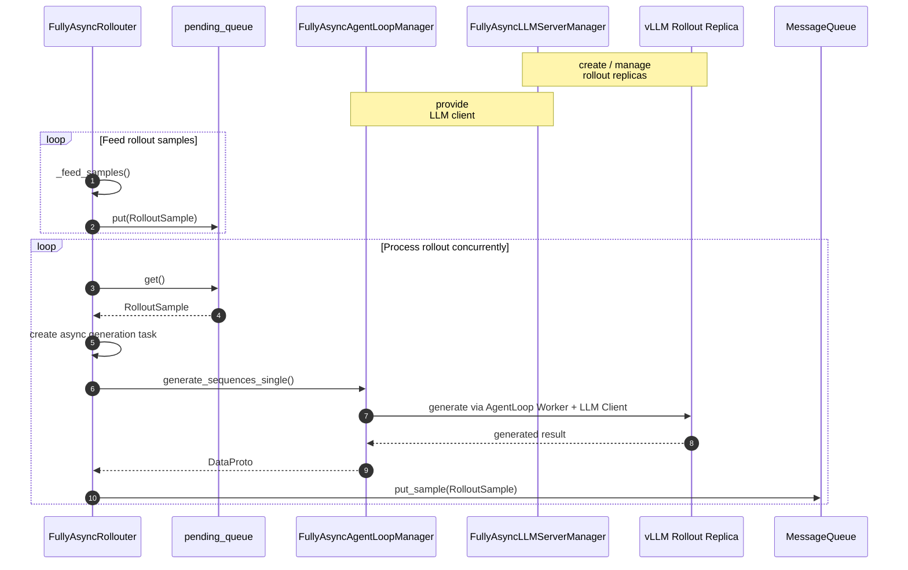

# 深入 verl Fully Async Training：从架构原理到 AMD ROCm 上的 DAPO 训练实践

> [!TIP]
> **Producer-Consumer**
>
> 生产者-消费者模式 （Producer-Consumer Pattern） 是一种经典的并发设计模式，用于解决两个处理速率不一致的组件之间的数据传输问题。
>
> - **核心思想**：生产者 （Producer） 和消费者 （Consumer）并不直接通信，而是通过一个 缓冲区 （Buffer/Queue）进行解耦。
> - **Producer**：负责生成数据，并将其放入缓冲区。如果缓冲区满了，生产者必须等待或丢弃数据。
> - **Consumer**：负责从缓冲区取出数据进行处理。如果缓冲区空了，消费者必须等待。
> - **Buffer**：平滑了生产和消费的速率波动，允许两者并行工作，互不阻塞。


我们从 [dapo_7b_math_fsdp2_4_4.sh](https://github.com/Vivicai1005/verl/blob/main/verl/experimental/fully_async_policy/shell/dapo_7b_math_fsdp2_4_4.sh)出发，沿着实际代码调用链去分析verl Fully Async Training的工作流程，并进一步理解rollout, training, sample queue 以及 parameter synchronization 是如何解耦并异步运行的。

整体调用链可以先概括为：

<details>
<summary>fully_async_main.py中main()代码</summary>
    
```python 
@hydra.main(config_path="config", config_name="fully_async_ppo_trainer", version_base=None)
def main(config):
    from verl.trainer.main_ppo import run_ppo

    # Ensure async training config exists
    if not hasattr(config, "async_training"):
        raise RuntimeError("must set async_training config")

    from time import time

    start_time = time()
    auto_set_device(config)
    # TODO: unify rollout config with actor_rollout_ref
    config.actor_rollout_ref.rollout.nnodes = config.rollout.nnodes
    config.actor_rollout_ref.rollout.n_gpus_per_node = config.rollout.n_gpus_per_node
    config = migrate_legacy_reward_impl(config)
    run_ppo(config, task_runner_class=FullyAsyncTaskRunner)
    print(f"total time: {time() - start_time:.2f} seconds")
```
</details>

## FullyAsyncTaskRunner
### `run_ppo`：启动 FullyAsyncTaskRunner
`fully_async_main.main()` 主要负责 Hydra 配置加载、device 配置以及部分 rollout 配置迁移，并通过：
```python
run_ppo(config, task_runner_class=FullyAsyncTaskRunner)
```
将训练流程交给 `FullyAsyncTaskRunner`。

`run_ppo()` 首先初始化 Ray runtime, 然后创建并启动`FullyAsyncTaskRunner`。

### `FullyAsyncTaskRunner.run()`
```python
def run(self, config):
    self._initialize_components(config)
    self._run_training_loop()
```

整个Fully Async 系统分成两个阶段:

(1) `_initialize_components()`: 创建并连接 Trainer, Rollouter, MessageQueue 等核心组件，完成 Fully Async Training 系统的初始化。

(2) `_run_training_loop()`: 并发启动 rollouter.fit() 和 trainer.fit(), 让 rollout generation 与 policy training 持续异步执行。Rollouter 通过 `MessageQueue` 向 Trainer 传递 rollout samples; Trainer 更新 policy 后，则通过 `CheckpointEngineManager` 将最新的 policy weights 同步到 rollout replicas。

下面我们将围绕 rollout sample flow 和 policy parameter synchronization，进一步介绍各个核心组件，以及它们是如何协同完成 Fully Async Training 的。

## FullyAsyncRollouter
在FullyAsyncTaskRunner `_initialize_components()` 中的 `_create_rollouter` 创建 Rollouter
```python
rollouter = FullyAsyncRollouter.remote(
    config=config,
    tokenizer=self.components["tokenizer"],
    processor=self.components["processor"],
    device_name=config.trainer.device,
)
```

`FullyAsyncRollouter` 是 Fully Async Training 中的 rollout producer。它独立维护 rollout 数据源，持续读取 prompt，并以 single sample 的方式提交给 rollout inference engine。 完成 generation 后的 `RolloutSample` 随后被写入 `MessageQueue`，供 `FullyAsyncTrainer` 异步消费。

`FullyAsyncRollouter` 的主要数据流可以概括为：


`FullyAsyncRollouter` 是 Fully Async Training 中的 rollout producer。它持续从训练数据集中读取prompt，将 rollout request 放入内部 `pending_queue`，随后由独立的 processor coroutine 从 `pending_queue` 中读取这些 request，并异步提交给 rollout inference engine。

### FullyAsyncRollouter.__init__()
`__init__()` 主要完成 Rollouter 自身的数据源、异步状态以及并发控制参数的初始化。

(1) 校验 Fully Async 配置
```python
assert not self.hybrid_engine
assert self.config.data.train_batch_size == 0
assert self.config.data.gen_batch_size == 1
assert self.config.async_training.staleness_threshold >= 0
assert self.config.async_training.trigger_parameter_sync_step >= 1
```
从 `self.config.data.gen_batch_size == 1` 里可以看出
Fully Async Rollouter 以 single sample 为单位不断提交 rollout，而不是先组织完整 rollout batch 再统一生成。

(2) 创建 Dataset 和 DataLoader
Fully Async 架构中 Rollouter 自己维护 rollout 数据源。
```python
train_dataset = create_rl_dataset(...)
val_dataset = create_rl_dataset(...)

train_sampler = create_rl_sampler(...)

self._create_dataloader(
    train_dataset,
    val_dataset,
    collate_fn,
    train_sampler,
)

self.total_rollout_steps = (
    len(self.train_dataloader)
    * self.config.trainer.total_epochs
)
```

(3) pending_queue 和 active_tasks
Rollouter 内部初始化了两个非常重要的异步状态：
```python
self.pending_queue = asyncio.Queue(maxsize=128)
self.active_tasks = set()
```

其中，`pending_queue` 是 `FullyAsyncRollouter` 内部用于连接 sample 生产 和 rollout generation 执行的异步缓冲队列， 最大可以暂存128个未被 processor 取走的 `RolloutSample`，它解耦了 sample feeding 与 rollout generation。而 `active_tasks` 则用于管理实际执行中并发的 rollout requests。

```
Dataset
   │
   ▼
pending_queue
   │
   │ _processor_worker() 取出
   ▼
active_tasks
   │
   ▼
AgentLoop / vLLM
```

### FullyAsyncRollouter.init_workers()
`FullyAsyncRollouter` 创建完成后，`FullyAsyncTaskRunner._create_rollouter()` 会调用 
```python
ray.get(rollouter.init_workers.remote())
```
在 `init_workers` 中 通过 `_init_async_rollout_manager` 创建两个核心组件：

```python
self.llm_server_manager = await FullyAsyncLLMServerManager.create(...)
self.async_rollout_manager = await FullyAsyncAgentLoopManager.create( config=self.config, llm_client=self.llm_server_manager.get_client(...), ... )
```

#### FullyAsyncLLMServerManager
`FullyAsyncLLMServerManager` 负责管理底层 rollout inference servers / replicas。比如在这个训练脚本中，它创建和维护 vLLM rollout replicas，并向上层提供 LLM client，使 AgentLoop 不需要直接感知具体的 replica。
```
FullyAsyncLLMServerManager
        │
        ├── create → vLLM Rollout Replicas
        │
        ├── create → GlobalRequestLoadBalancer
        │
        └── get_client()
                    │
                    ▼
          FullyAsyncLLMServerClient
```

#### FullyAsyncAgentLoopManager
`FullyAsyncAgentLoopManager` 位于 `FullyAsyncRollouter` 和 底层 rollout inference engine 之间。Rollouter 将 single sample request 提交给它，它选择一个 AgentLoop Worker 执行 generation；AgentLoop Worker 再通过 LLM client 将请求发送到底层 vLLM replica。

```
FullyAsyncRollouter
        │
        ▼
FullyAsyncAgentLoopManager
        │
        ▼
AgentLoop Worker
        │
        ▼
FullyAsyncLLMServerClient
        │
        ▼
GlobalRequestLoadBalancer
        │
        ▼
vLLM Rollout Replica
```

### FullyAsyncRollouter.fit()
前面的 `__init__()` 和 `init_workers()` 完成了 Rollouter 的自身状态以及 rollout inference infrastructure 的初始化。真正开始生成 rollout samples， 则从 `FullyAsyncRollouter.fit()` 开始。
在 `fit()`中启动
```python
generation_task = safe_create_task(
    self._streaming_generation_main(),
    name="generation_task",
)

monitor_task = safe_create_task(
    self._async_monitor_loop(),
    name="monitor_task",
)
```

(1) `_feed_samples()`：从 Dataset 产生 `RolloutSample`
`_feed_samples()` 持续遍历 trainer_dataloader， 以 single sample 为单位不断向 `pending_queue` 中提交 rollout request。
```python
for epoch, batch_dict in continuous_iterator:
    full_batch = prepare_single_generation_data(
        batch_dict,
        self.config,
    )

    rollout_sample = RolloutSample(
        full_batch=full_batch,
        sample_id=sample_id,
        epoch=epoch,
        rollout_status={},
    )

    await self.pending_queue.put(rollout_sample)
```

（2）`_processor_worker()`：从 pending_queue 取出 sample
`_processor_worker()` 持续从 `pending_queue` 中读取 rollout sample。
```python
rollout_sample = await self.pending_queue.get()
self.pending_queue.task_done()
```
但并不会直接同步执行完整的generation，而是为这个 sample 创建一个独立的 async task。所以数据流从 ```pending_queue``` 进入 ```active_tasks```。
```python
task = safe_create_task(
    self._process_single_sample_streaming(rollout_sample),
    name=rollout_sample.sample_id,
    task_set=self.active_tasks,
)
```
`pending_queue` 保存的是等待被提交 generation 的 samples，而 `active_task` 保存的是已经提交、正在执行 generation 的 tasks。

（3）`_process_single_sample_streaming()`：提交给AgentLoop

（4）`FullyAsyncAgentLoopMageger`：将 request 送到 rollout replica
`FullyAsyncAgentLoopManager.generate_sequences_single()` 会选择一个 AgentLoop Wokrer。
```python
worker = self._select_best_worker()

output_future = worker.generate_sequences.remote(prompts)
```
AgentLoop Worker 再通过 `FullyAsyncLLMServerClient` 将 generation request 路由到具体的 vLLM replica。

（5）vLLM 返回 generation result
vLLM 完成 inference 后， generated tokens, log probs 等信息最终被 AgentLoop 整理 为 DataProto 返回。然后回答：
```python
_process_single_sample_streaming()
```
中
```python
rollout_sample.full_batch = ret
```
于是原本只包含 prompt 等输入信息的 `RolloutSample`，现在已经包含完成 generation 后的 rollout 数据。

## FullyAsyncTrainer

## MessageQueue


