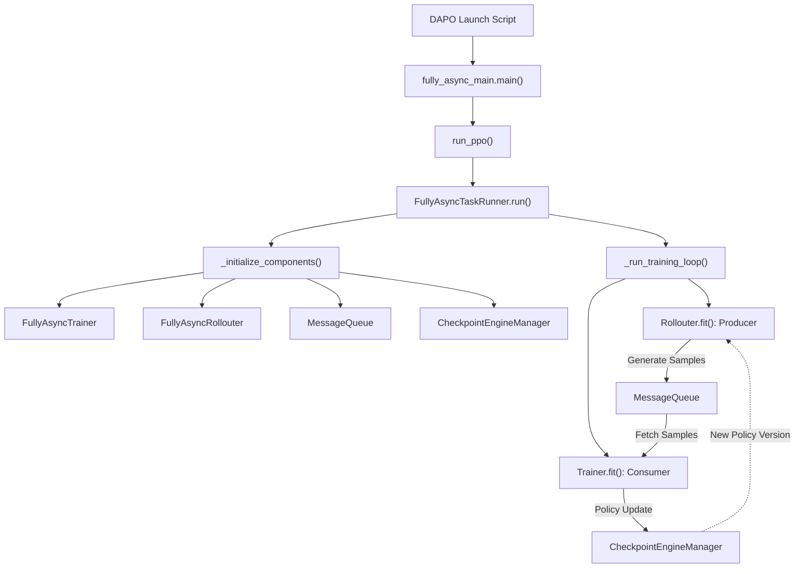
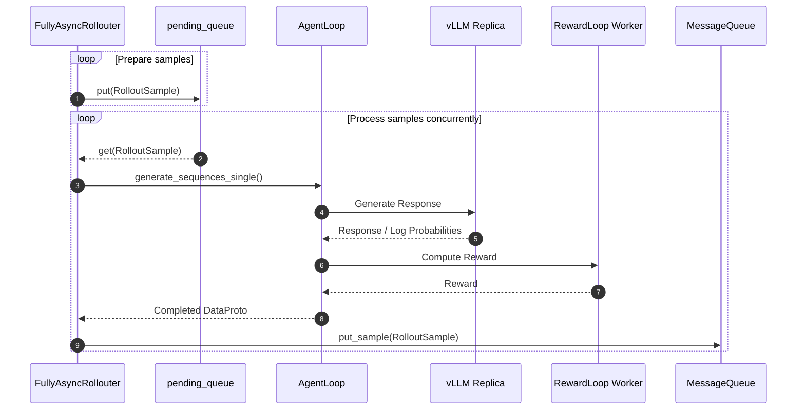
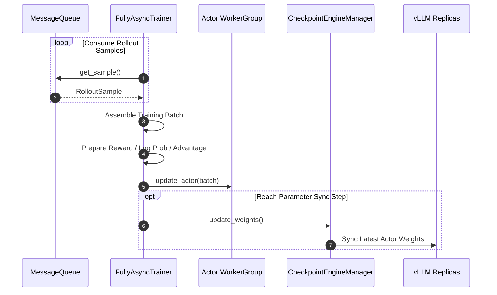

# 深入 verl Fully Async Policy Training: 从架构原理到 AMD ROCm 上的 DAPO 训练实践

大语言模型的 RL 训练主要围绕两个过程展开：Rollout 使用当前 Policy 生成训练样本，Training 使用这些样本更新 Policy。在同步训练中，它们只能交替运行：Training 要等 Rollout 生成完样本才能开始，而在模型更新和参数同步期间，Rollout 也不得不停下来等待。这样的同步方式会产生不少 Pipeline Bubbles，让部分 GPU 在等待期间处于空闲状态。

Fully Async Policy Training 的思路，是为 Rollout 和 Training 分配独立的 GPU 资源，并通过 Sample Queue 在两者之间传递样本。从系统设计的角度来看，这其实是一种经典的 Producer-Consumer 模式：Rollouter 是 Producer，负责持续生成样本；Trainer 是 Consumer，负责获取样本并更新 Policy；Sample Queue 则作为两者之间的异步缓冲区，帮助它们按照各自的节奏运行。

与此同时，最新的 Policy 参数会定期同步给 Rollouter，让样本生成、模型训练和参数同步尽可能重叠执行，从而减少等待时间并提高 GPU 利用率。

接下来，我们将从 [dapo_7b_math_fsdp2_4_4.sh](https://github.com/verl-project/verl/blob/main/verl/experimental/fully_async_policy/shell/dapo_7b_math_fsdp2_4_4.sh)出发，沿着实际代码调用链去分析verl Fully Async Policy Training的工作流程，并进一步理解rollout, training, sample queue 以及 parameter synchronization 是如何解耦并异步运行的。

整体调用链可以先概括为：

## FullyAsyncTaskRunner
### `run_ppo`：启动 FullyAsyncTaskRunner
<details>
<summary>fully_async_main.py中main()代码</summary>
    
```python 
@hydra.main(config_path="config", config_name="fully_async_ppo_trainer", version_base=None)
def main(config):
    from verl.trainer.main_ppo import run_ppo

    # Ensure async training config exists
    if not hasattr(config, "async_training"):
        raise RuntimeError("must set async_training config")

    from time import time

    start_time = time()
    auto_set_device(config)
    # TODO: unify rollout config with actor_rollout_ref
    config.actor_rollout_ref.rollout.nnodes = config.rollout.nnodes
    config.actor_rollout_ref.rollout.n_gpus_per_node = config.rollout.n_gpus_per_node
    config = migrate_legacy_reward_impl(config)
    run_ppo(config, task_runner_class=FullyAsyncTaskRunner)
    print(f"total time: {time() - start_time:.2f} seconds")
```
</details>

`fully_async_main.main()` 主要负责 Hydra 配置加载、device 配置以及部分 rollout 配置迁移，并通过下面这行代码将训练流程交给 `FullyAsyncTaskRunner`。：
```python
run_ppo(config, task_runner_class=FullyAsyncTaskRunner)
```

`run_ppo()` 会初始化 Ray Runtime，并创建 FullyAsyncTaskRunner，随后调用它的 `run()`方法 ，正式进入 Fully Async Policy Training 的初始化与执行流程。

### `FullyAsyncTaskRunner.run()`
```python
def run(self, config):
    self._initialize_components(config)
    self._run_training_loop()
```

整个Fully Async 系统的运行过程分成两个阶段:

(1) `_initialize_components()`: 创建 `FullyAsyncTrainer` 与 `FullyAsyncRollouter`，建立两者之间的引用关系，并创建共享的 `MessageQueue`。当 Rollouter 被注入 Trainer 时，Trainer 会在内部创建 `CheckpointEngineManager`，用于后续将 Actor 参数同步到 Rollout Replicas。

(2) `_run_training_loop()`: 并发启动 Rollouter.fit() 和 Trainer.fit(), 让 Rollout Generation 与 Policy Training 持续异步执行。Rollouter 通过 `MessageQueue` 向 Trainer 传递 Rollout Samples; Trainer 更新 Policy 后，则通过 `CheckpointEngineManager` 将最新的 Policy Weights 同步到 Rollout Replicas。

接下来，我们将介绍系统中的核心组件，并沿着样本传递与参数同步流程，分析 Rollout Generation 和 Policy Training 如何异步运行。

## MessageQueue
在深入 `FullyAsyncRollouter` 和 `FullyAsyncTrainer` 的具体流程之前，我们先来看连接两者的 `MessageQueue`。

在这套 Producer-Consumer 模型中，`FullyAsyncRollouter` 是 Producer，负责生成完整的 `RolloutSample` 并将其写入 `MessageQueue`；`FullyAsyncTrainer` 是 Consumer，负责逐个读取样本，并在收集到足够数量后将它们组装成 Training Batch，用于后续的 Policy Update。

`MessageQueue` 作为 Rollout Generation 与 Policy Training 之间的异步缓冲区，可以协调两者处理速度上的差异，使 Rollouter 和 Trainer 按照各自的节奏运行。当队列中没有足够的样本时，Trainer 才需要等待 Rollouter 继续生成。

### MessageQueue 的创建
`MessageQueue` 由 `FullyAsyncTaskRunner._initialize_components()` 创建：
```python
max_queue_size = ray.get(
    self.components["rollouter"].get_max_queue_size.remote()
)

message_queue = MessageQueue.remote(
    config,
    max_queue_size,
)

message_queue_client = MessageQueueClient(message_queue)
```
`MessageQueue` 是一个独立的 Ray Actor，`MessageQueueClient` 则封装了与它通信的接口。
创建完成后，指向同一个 `MessageQueue` 的 Client 会被注入 Rollouter 和 Trainer:
```python
ray.get( self.components["rollouter"] .set_message_queue_client.remote(message_queue_client) )
ray.get( self.components["trainer"] .set_message_queue_client.remote(message_queue_client) )
```
至此，Rollouter 和 Trainer 之间的样本传递通道就建立起来了。接下来，我们先从 Producer 一侧开始，看看 `FullyAsyncRollouter` 如何持续生成 Rollout Samples，并将它们写入 `MessageQueue`。

## FullyAsyncRollouter
在`FullyAsyncTaskRunner._initialize_components()` 中， `_create_rollouter` 会创建并初始化 `FullyAsyncRollouter`：
```python
trainer = FullyAsyncTrainer.remote( config=config, tokenizer=self.components["tokenizer"], role_worker_mapping=trainer_role_mapping, resource_pool_manager=create_resource_pool_manager( config, roles=list(trainer_role_mapping.keys()), ), ray_worker_group_cls=self.components["ray_worker_group_cls"], device_name=config.trainer.device, )
```

`FullyAsyncRollouter` 是 Fully Async Policy Training 中的 Producer， 负责持续读取 Prompt，并以单个样本为粒度发起异步生成任务。

它首先将待处理的 `RolloutSample` 放入内部的 `pending_queue`。随后，`_processor_worker()` 从队列中取出样本，为每个样本创建独立的异步生成任务，并通过 `FullyAsyncAgentLoopManager` 将请求发送给底层 vLLM Replica。Generation 和 Reward Calculation 完成后，Rollouter 再将完整的 `RolloutSample` 写入 `MessageQueue`。

`FullyAsyncRollouter` 的主要数据流可以概括为：


### FullyAsyncRollouter.__init__()
`__init__()` 主要负责校验 Fully Async 配置，创建 Rollout 数据源，并初始化后续异步生成所需的状态。

(1) 校验 Fully Async 配置
```python
assert not self.hybrid_engine
assert self.config.data.train_batch_size == 0
assert self.config.data.gen_batch_size == 1
assert self.config.async_training.staleness_threshold >= 0
assert self.config.async_training.trigger_parameter_sync_step >= 1
```
其中，`self.config.data.gen_batch_size == 1` 表明 Fully Async Rollouter 以 single sample 为单位不断提交 rollout，而不是先组织完整 rollout batch 再统一生成。

(2) 创建 Dataset 和 DataLoader
Fully Async 架构中的训练数据由 Rollouter 读取，因为 Prompt 是在 Rollout 一侧被转换成训练样本的：
```python
train_dataset = create_rl_dataset(...)
val_dataset = create_rl_dataset(...)

train_sampler = create_rl_sampler(...)

self._create_dataloader(
    train_dataset,
    val_dataset,
    collate_fn,
    train_sampler,
)
```

(3) 初始化 pending_queue 和 active_tasks
Rollouter 维护了两个重要的异步状态：
```python
self.pending_queue = asyncio.Queue(maxsize=128)
self.active_tasks = set()
```
`pending_queue` 保存等待提交 Generation 的 `RolloutSample`。 `active_tasks` 则用于跟踪已经提交、仍在执行的异步 Generation Tasks。

### FullyAsyncRollouter.init_workers()
创建 Rollouter 后，`FullyAsyncTaskRunner._create_rollouter()` 会调用：
```python
ray.get(rollouter.init_workers.remote())
```
`init_workers()` 会初始化异步状态，并创建 Reward 和 Rollout Generation 所需的基础组件：

```python
async def init_workers(self):
    self._init_async_objects()
    self._create_worker_classes()
    await self._create_reward_loop_manager()
    await self._create_teacher_model_manager()
    await self._init_async_rollout_manager()
    SkipManager.init(self.config)
```
对于当前 DAPO Training，主要涉及以下三个组件：
- `RewardLoopManager`: 创建并管理 RewardLoop Workers，负责计算答案得分和 Overlong Penalty；
- `FullyAsyncLLMServerManager`: 创建和管理底层 Rollout Replicas，并通过 `GlobalRequestLoadBalancer` 将 Generation Request 路由到可用的 vLLM Server；
- `FullyAsyncAgentLoopManager`: 把单个样本分发给 AgentLoop Worker。AgentLoop Worker 通过 LLM Client 完成 Generation，并在生成结束后调用 RewardLoop Worker 计算 Reward。

### FullyAsyncTrainer.__init__()
完成初始化后，`FullyAsyncRollouter.fit()` 会启动持续生成样本的异步流程。其中，`_feed_samples()` 负责从 `DataLoader` 读取 Prompt 并准备 `RolloutSample`，`_processor_worker()` 则负责提交异步 Generation Task。

接下来，我们沿着一个 `RolloutSample` 的数据流，看看它如何完成从 Prompt 读取、Response Generation、Reward Calculation 到写入 `MessageQueue` 的全过程。

(1) train_dataloader → pending_queue

`_feed_samples()` 持续遍历 `train_dataloader`，每读取到一个 Prompt，就会通过 `prepare_single_generation_data()` 准备生成输入，并将其封装成 `RolloutSample`：
```python
for epoch, batch_dict in continuous_iterator:
    full_batch = prepare_single_generation_data(
        batch_dict,
        self.config,
    )

    rollout_sample = RolloutSample(
        full_batch=full_batch,
        sample_id=sample_id,
        epoch=epoch,
        rollout_status={},
    )

    await self.pending_queue.put(rollout_sample)
```
此时，`RolloutSample.full_batch` 主要包含 Prompt 等生成输入，还没有 Response 和 Reward。样本会先进入 `pending_queue`，等待后续处理。

(2) pending_queue → async generation task

`_processor_worker()` 持续从 `pending_queue` 中获取样本：
```python
rollout_sample = await self.pending_queue.get()
self.pending_queue.task_done()
```
取出样本后，它不会同步等待整个 Generation 完成，而是为这个样本创建一个独立的异步任务：
```python
task = safe_create_task(
    self._process_single_sample_streaming(rollout_sample),
    name=rollout_sample.sample_id,
    task_set=self.active_tasks,
)
```
创建出的任务会被加入 `active_tasks`，以便 Rollouter 跟踪当前正在运行的 Generation Tasks。

(3) async generation task → AgentLoop → vLLM

每个异步任务都会进入 `_process_single_sample_streaming()`，并将样本输入提交给 `FullyAsyncAgentLoopManager`：
```python
ret = await self.async_rollout_manager.generate_sequences_single( rollout_sample.full_batch )
```

`FullyAsyncAgentLoopManager.generate_sequences_single()` 会选择一个 AgentLoop Worker：
```python
worker = self._select_best_worker()
output_future = worker.generate_sequences.remote(prompts)
```
AgentLoop Worker 随后通过 `FullyAsyncLLMServerClient` 将 Generation Request 路由到可用的 vLLM Replica。vLLM 完成推理后，会返回 Generated Tokens 和 Rollout Log Probabilities 等结果。

(4) vLLM → AgentLoop → RewardLoop Worker

收到 vLLM 返回的生成结果后，AgentLoop Worker 会完成 Response、Response Mask 和 Rollout Log Probabilities 等数据的整理。随后，它会选择一个 RewardLoop Worker 计算 Reward：
```python
selected_reward_loop_worker_handle = random.choice( self.reward_loop_worker_handles )

result = await selected_reward_loop_worker_handle.compute_score.remote( data )
```

Reward 计算完成后，AgentLoop 会将结果整理到 `rm_scores` 等字段中，并与 Response、Response Mask 和 Rollout Log Probabilities 一起封装成完整的 `DataProto`。

(5) RolloutSample → MessageQueue

Rollouter 收到 AgentLoop 返回的 DataProto 后，会把它写回当前的 RolloutSample：
```python
rollout_sample.full_batch = ret
```
到这里，这个 `RolloutSample` 已经包含完整的生成结果。它通常对应一个 Prompt，并包含该 Prompt 生成的多条 Rollout Trajectories。每条 Trajectory 都带有相应的 Response、Rollout Log Probabilities 和 Reward。

最后，Rollouter 将 `RolloutSample` 序列化并写入 `MessageQueue`：
```python
success = await self.message_queue_client.put_sample( sample=ray.cloudpickle.dumps(rollout_sample), )
```
至此，一个 `RolloutSample` 就走完了从 Prompt 读取、异步 Generation、Reward Calculation 到进入训练队列的完整流程。

接下来，我们来到 Consumer 一侧，看看 `FullyAsyncTrainer` 如何从 `MessageQueue` 中取出这些样本、更新 Actor Policy，并将最新参数同步回 Rollout Replicas。

## FullyAsyncTrainer
在`FullyAsyncTaskRunner._initialize_components()` 中， `_create_trainer()` 会创建 `FullyAsyncTrainer`：
```python
trainer = FullyAsyncTrainer.remote(
    config=config,
    tokenizer=self.components["tokenizer"],
    role_worker_mapping=trainer_role_mapping,
    resource_pool_manager=create_resource_pool_manager(
        config,
        roles=list(trainer_role_mapping.keys()),
    ),
    ray_worker_group_cls=self.components["ray_worker_group_cls"],
    device_name=config.trainer.device,
)
```
`FullyAsyncTrainer` 是 Fully Async Training 中的 Consumer。它持续从 `MessageQueue` 中获取 Rollouter 生成的 `RolloutSample`，收集到足够数量后，将这些样本组装成 Training Batch，并完成 Advantage 计算和 Actor Policy Update。

当本地训练达到参数同步周期后，Trainer 还会通过 `CheckpointEngineManager` 将最新的 Actor Weights 同步给 vLLM Rollout Replicas。这样，Rollouter 后续生成的样本就可以逐步切换到更新后的 Policy Version。

`FullyAsyncTrainer` 的主要数据流可以概括为：


### FullyAsyncTrainer.init()
`__init__()` 主要保存训练配置，并准备 Sample Consumption、Policy Training 和 Parameter Synchronization 所需的状态
Trainer 首先会根据算法配置判断是否需要 Reference Policy 和 Critic：
```python
self.required_samples = (
    config.actor_rollout_ref.actor.ppo_mini_batch_size
    * config.async_training.require_batches
)
```
Actor 是 Policy Training 的核心组件，因此一定会创建；Reference Policy 和 Critic 则只在算法需要时创建。
当前 DAPO 使用 GRPO 计算 Advantage，不依赖 Critic Value Model。如果没有启用 KL Reward 或 KL Loss，通常也不需要额外创建 Reference Policy。

接下来，Trainer 会计算每个 Training Step 需要从 `MessageQueue` 中收集多少个样本：
```python
self.required_samples = config.actor_rollout_ref.actor.ppo_mini_batch_size * config.async_training.require_batches
```
只有收集到足够数量的 `RolloutSample` 后，Trainer 才会将它们组装成 Training Batch。

最后，`__init__()` 会初始化参数同步状态，并为其他组件预留引用：
```python
self.local_trigger_step = 1
self.current_param_version = 0
self.trigger_parameter_sync_step = (
    config.async_training.trigger_parameter_sync_step
)

self.message_queue_client = None
self.rollouter = None
self.checkpoint_manager = None
```
这些状态分别用于记录当前参数同步周期、Policy Version，以及后续连接 `MessageQueue`、Rollouter 和 `CheckpointEngineManager`。

### FullyAsyncTrainer.init_workers()
创建 Trainer 后，`FullyAsyncTaskRunner._create_trainer()` 会继续调用：
```python
ray.get(trainer.init_workers.remote())
```
`init_workers()` 负责在 Training GPUs 上创建真正执行训练的分布式 Workers：
```python
async def init_workers(self):
    self._init_resource_pools()
    self._create_worker_classes()
    self._init_worker_groups()
    self._init_models()
```
其中，`_create_worker_classes()` 确定需要创建 Actor、Reference Policy 或 Critic 等哪些 Workers；`_init_worker_groups()` 根据这些 Worker Classes 创建对应的 Ray WorkerGroups，并将它们保存在 `self.all_wg` 中。

最后，`_init_models()` 从 self.all_wg 中取出 Actor WorkerGroup，并初始化 Actor Model：
```python
self.actor_wg = self.all_wg[str(self.train_role)] self.actor_wg.init_model()
```
这里的 `actor_wg` 是后续执行 Policy Training 的核心组件，负责计算 Policy Loss、执行反向传播，并通过 Optimizer Step 更新 Actor Parameters。

### FullyAsyncTrainer.fit()
完成运行状态和 Training WorkerGroups 的初始化后，`FullyAsyncTrainer.fit()` 会开始持续消费 Rollout Samples，并更新 Actor Policy。
它的核心是一个不断执行 `fit_step()` 的循环：

```python
while True:
    try:
        await self.fit_step()
    except TrainingStopException:
        break
```
当 Rollouter 完成全部生成任务并关闭 `MessageQueue` 后，Trainer 会继续处理队列中剩余的样本。队列耗尽后，`get_sample()` 返回 `None`，Trainer 随即结束训练循环。

#### FullyAsyncTrainer.fit_step()
`fit_step()` 描述了一次 Training Step 的核心流程：
```python
batch = await self._fit_generate(None)

batch = self._fit_compute_reward(batch)
batch = self._fit_compute_log_prob(batch)
batch = self._fit_compute_ref_log_prob(batch)
batch = self._fit_compute_critic(batch)
batch = self._fit_compute_advantage(batch)

batch = self._fit_update_critic(batch)
batch = self._fit_update_actor(batch)

self._fit_update_local_step()
await self._fit_update_weights()
```

接下来，我们沿着一批 `RolloutSample` 的流动过程，看看 Trainer 如何完成一次 Policy Update。
(1) MessageQueue → RolloutSample

一次 Training Step 从 `_fit_generate()` 开始：
```python
batch = await self._fit_generate(None)

epoch, batch = await self._get_samples_from_queue()

sample, queue_len = await self.message_queue_client.get_sample()
```
Trainer 会持续从 `MessageQueue` 中读取数据，直到收集到 `self.required_samples` 个 `RolloutSample`。随后，这些数据会被反序列化，并通过 `assemble_batch_from_rollout_samples()` 合并成用于 PPO / GRPO Training 的 `DataProto` Batch。

(2) Training Batch → Reward / Log Prob / Advantage

拿到 Training Batch 后，Trainer 开始准备 Policy Update 所需的训练信号：
```python
batch = self._fit_compute_reward(batch)
batch = self._fit_compute_log_prob(batch)
batch = self._fit_compute_ref_log_prob(batch)
batch = self._fit_compute_critic(batch)
batch = self._fit_compute_advantage(batch)
```
`_fit_compute_reward()` 从 Batch 中提取 Rollout 侧已经计算好的 Reward，`_fit_compute_log_prob()` 准备训练所需的 old_log_probs。Reference Policy 和 Critic 相关计算只在算法需要时执行。
`_fit_compute_advantage()` 会比较同一个 Prompt 对应的一组 Responses，并根据它们的相对 Reward 计算 Advantage，为后续的 Policy Update 做好准备。

(3) Training Batch → Actor Policy

Reward、Log Probabilities 和 Advantages 准备完成后，Trainer 调用：
```python
batch = self._fit_update_actor(batch)
```
`_fit_update_actor()` 使用 Training Batch 中的 Responses、old_log_probs、Advantages 等数据计算 Policy Loss，再通过 `actor_wg` 在 Training GPUs 上执行反向传播和 Optimizer Step，从而更新 Actor Policy。

(4) Actor Weights → vLLM Rollout Replicas

`_fit_update_actor()` 更新的是 Training 侧的 Actor Weights。Rollout 侧的 vLLM Replicas 不会自动获得这些新参数，因此 Trainer 还需要记录本地 Training Step，并在到达同步周期后更新 Rollout Policy：
```python
self._fit_update_local_step()
await self._fit_update_weights()
```
`_fit_update_local_step()` 的核心逻辑是：
```python
if self.local_trigger_step < self.trigger_parameter_sync_step:
    self.local_trigger_step += 1
else:
    self.current_param_version += 1
    self.local_trigger_step = 1
```
如果当前同步周期还没有完成，`local_trigger_step` 会继续增加；当完成 `trigger_parameter_sync_step` 个 Training Steps 后，Trainer 会更新 `current_param_version`，并将 `local_trigger_step` 重置为 1。

随后，`_fit_update_weights()` 会检查当前是否到达 Parameter Synchronization Point：
```python
if self.local_trigger_step != 1:
    return None
```

只有 `local_trigger_step` 回到 1 时，才会真正执行参数同步：
```python
await self.checkpoint_manager.update_weights(global_steps=self.current_param_version,)
```
`CheckpointEngineManager` 将 Trainer 中最新的 Actor Weights 同步到 vLLM Replicas。同步完成后，Rollouter 可以使用新的 Policy Version 继续生成 Trajectories。

