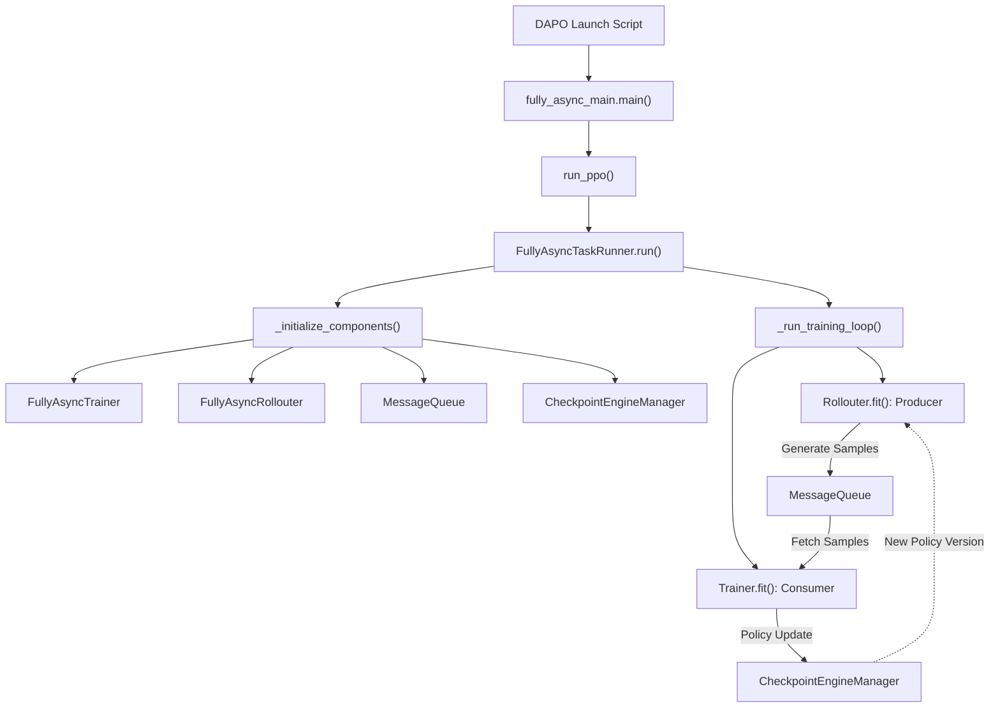
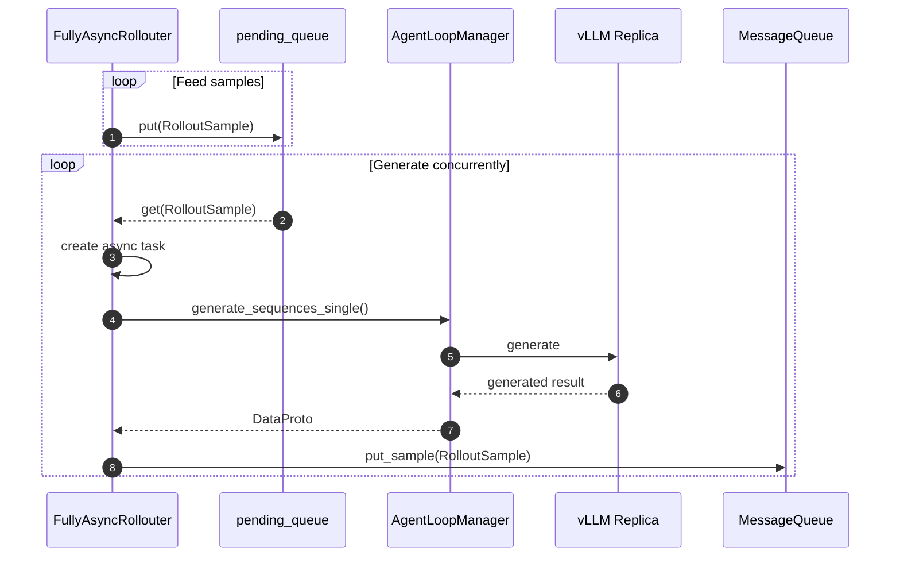
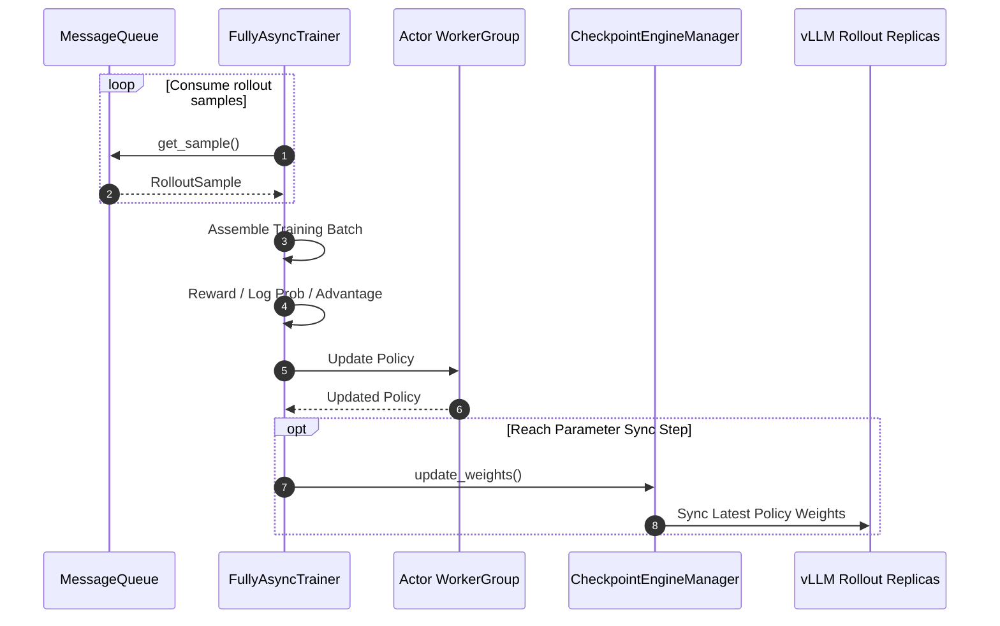

# 深入 verl Fully Async Policy Training：从架构原理到 AMD ROCm 上的 DAPO 训练实践

大语言模型的 RL 训练主要围绕两个过程展开：Rollout 使用当前 Policy 生成训练样本，Training 使用这些样本更新 Policy。在同步训练中，它们只能交替运行：Training 要等 Rollout 生成完样本才能开始，而在模型更新和参数同步期间，Rollout 也不得不停下来等待。这样的同步方式会产生不少 Pipeline Bubbles，让部分 GPU 在等待期间处于空闲状态。

Fully Async Policy Training 的思路，是为 Rollout 和 Training 分配独立的 GPU 资源，并通过 Sample Queue 在两者之间传递样本。从系统设计的角度来看，这其实是一种经典的 Producer-Consumer 模式：Rollouter 是 Producer，负责持续生成样本；Trainer 是 Consumer，负责获取样本并更新 Policy；Sample Queue 则作为两者之间的异步缓冲区，帮助它们按照各自的节奏运行。

与此同时，最新的 Policy 参数会定期同步给 Rollouter，让样本生成、模型训练和参数同步尽可能重叠执行，从而减少等待时间并提高 GPU 利用率。

接下来，我们将从 [dapo_7b_math_fsdp2_4_4.sh](https://github.com/verl-project/verl/blob/main/verl/experimental/fully_async_policy/shell/dapo_7b_math_fsdp2_4_4.sh)出发，沿着实际代码调用链去分析verl Fully Async Training的工作流程，并进一步理解rollout, training, sample queue 以及 parameter synchronization 是如何解耦并异步运行的。

整体调用链可以先概括为：

## FullyAsyncTaskRunner
### `run_ppo`：启动 FullyAsyncTaskRunner
<details>
<summary>fully_async_main.py中main()代码</summary>
    
```python 
@hydra.main(config_path="config", config_name="fully_async_ppo_trainer", version_base=None)
def main(config):
    from verl.trainer.main_ppo import run_ppo

    # Ensure async training config exists
    if not hasattr(config, "async_training"):
        raise RuntimeError("must set async_training config")

    from time import time

    start_time = time()
    auto_set_device(config)
    # TODO: unify rollout config with actor_rollout_ref
    config.actor_rollout_ref.rollout.nnodes = config.rollout.nnodes
    config.actor_rollout_ref.rollout.n_gpus_per_node = config.rollout.n_gpus_per_node
    config = migrate_legacy_reward_impl(config)
    run_ppo(config, task_runner_class=FullyAsyncTaskRunner)
    print(f"total time: {time() - start_time:.2f} seconds")
```
</details>

`fully_async_main.main()` 主要负责 Hydra 配置加载、device 配置以及部分 rollout 配置迁移，并通过下面这行代码将训练流程交给 `FullyAsyncTaskRunner`。：
```python
run_ppo(config, task_runner_class=FullyAsyncTaskRunner)
```

`run_ppo()` 会初始化 Ray Runtime，并创建 FullyAsyncTaskRunner，随后调用它的 `run()` ，正式进入 Fully Async Policy Training 的初始化与执行流程。

### `FullyAsyncTaskRunner.run()`
```python
def run(self, config):
    self._initialize_components(config)
    self._run_training_loop()
```

整个Fully Async 系统的运行过程分成两个阶段:

(1) `_initialize_components()`: 创建并连接 `FullyAsyncTrainer`、`FullyAsyncRollouter`、`MessageQueue`、`CheckpointEngineManager` 等核心组件，为后续的异步训练做好准备。

(2) `_run_training_loop()`: 并发启动 Rollouter.fit() 和 Trainer.fit(), 让 Rollout Generation 与 Policy Training 持续异步执行。Rollouter 通过 `MessageQueue` 向 Trainer 传递 Rollout Samples; Trainer 更新 Policy 后，则通过 `CheckpointEngineManager` 将最新的 Policy Weights 同步到 Rollout Replicas。

接下来，我们将顺着 Rollout Sample Flow 和 Policy Parameter Synchronization 这两条核心数据流，逐一介绍系统中的重要组件，看看它们是如何相互配合，让 Rollout 和 Training 异步运行起来的。

## MessageQueue
在深入 `FullyAsyncRollouter` 和 `FullyAsyncTrainer` 的具体流程之前，我们先来看看连接两者的 `MessageQueue`。

在这套 Producer-Consumer 模型中，FullyAsyncRollouter 扮演 Producer 的角色：它持续生成完整的 RolloutSample，并将其写入 MessageQueue。FullyAsyncTrainer 则是 Consumer：它不断从队列中获取样本，在收集到足够数量后，将这些样本组装成 Training Batch，用于后续的 Policy 更新。

因此，`MessageQueue` 不只是一个传递样本的队列，它还是 Rollout Generation 与 Policy Training 之间的异步缓冲区。即使 Rollouter 和 Trainer 的处理速度不同，也不需要相互等待，而是可以按照各自的节奏持续运行。

### MessageQueue 的创建
`MessageQueue` 由 `FullyAsyncTaskRunner._initialize_components()` 创建：
```python
max_queue_size = ray.get(
    self.components["rollouter"].get_max_queue_size.remote()
)

message_queue = MessageQueue.remote(
    config,
    max_queue_size,
)

message_queue_client = MessageQueueClient(message_queue)
```
`MessageQueue` 是一个独立的 Ray Actor，`MessageQueueClient` 则封装了与它通信的接口。
创建完成后，指向同一个 `MessageQueue` 的 Client 会被注入 Rollouter 和 Trainer：：
```python
ray.get( self.components["rollouter"] .set_message_queue_client.remote(message_queue_client) )
ray.get( self.components["trainer"] .set_message_queue_client.remote(message_queue_client) )
```
至此，Rollouter 和 Trainer 之间的样本传递通道就建立起来了。

接下来，我们先从 Producer 一侧开始，看看 `FullyAsyncRollouter` 如何持续生成 Rollout Samples，并将它们写入 `MessageQueue`。

## FullyAsyncRollouter
在`FullyAsyncTaskRunner._initialize_components()` 中， `_create_rollouter` 会创建 `FullyAsyncRollouter`：
```python
rollouter = FullyAsyncRollouter.remote(
    config=config,
    tokenizer=self.components["tokenizer"],
    processor=self.components["processor"],
    device_name=config.trainer.device,
)
```

`FullyAsyncRollouter` 是 Fully Async Policy Training 中的 Rollout Producer， 负责持续读取 Prompt，并以单个样本为粒度发起异步生成任务。

它首先将等待生成的 `RolloutSample` 放入内部的 `pending_queue`。Processor Worker 从队列中取出样本并创建异步任务，再通过 `FullyAsyncAgentLoopManager` 将生成请求发送给 vLLM Rollout Replica。生成完成后，包含完整 Response 的 `RolloutSample` 会被写入 `MessageQueue`，等待 `FullyAsyncTrainer` 获取和消费。

这里需要注意两个队列的区别：
- `pending_queue` 是 Rollouter 内部的任务队列，用来保存等待执行生成任务的样本；
- `MessageQueue` 位于 Rollouter 和 Trainer 之间，用来保存已经完成生成、可以用于训练的样本。

`FullyAsyncRollouter` 的主要数据流可以概括为：


`pending_queu`e 将样本读取与生成任务解耦，使 Rollouter 可以一边准备新的样本，一边处理正在运行的生成任务。`MessageQueue` 则进一步将 Rollout Generation 与 Policy Training 解耦，让 Rollouter 在写入完整样本后继续生成，而不需要等待 Trainer 完成训练。

### FullyAsyncRollouter.__init__()
`__init__()` 主要完成 Rollouter 自身的数据源、异步状态以及并发控制参数的初始化。

(1) 校验 Fully Async 配置
```python
assert not self.hybrid_engine
assert self.config.data.train_batch_size == 0
assert self.config.data.gen_batch_size == 1
assert self.config.async_training.staleness_threshold >= 0
assert self.config.async_training.trigger_parameter_sync_step >= 1
```
从 `self.config.data.gen_batch_size == 1` 里可以看出
Fully Async Rollouter 以 single sample 为单位不断提交 rollout，而不是先组织完整 rollout batch 再统一生成。

(2) 创建 Dataset 和 DataLoader
Fully Async 架构中 Rollouter 自己维护 rollout 数据源。
```python
train_dataset = create_rl_dataset(...)
val_dataset = create_rl_dataset(...)

train_sampler = create_rl_sampler(...)

self._create_dataloader(
    train_dataset,
    val_dataset,
    collate_fn,
    train_sampler,
)

self.total_rollout_steps = (
    len(self.train_dataloader)
    * self.config.trainer.total_epochs
)
```

(3) pending_queue 和 active_tasks
Rollouter 内部初始化了两个非常重要的异步状态：
```python
self.pending_queue = asyncio.Queue(maxsize=128)
self.active_tasks = set()
```

其中，`pending_queue` 保存等待提交 Generation 的 `RolloutSample`。而 `active_tasks` 则用于跟踪已经提交、正在运行的异步 Generation Tasks。

### FullyAsyncRollouter.init_workers()
创建 Rollouter 后，`FullyAsyncTaskRunner._create_rollouter()` 会调用：
```python
ray.get(rollouter.init_workers.remote())
```
在 `init_workers` 中 通过 `_init_async_rollout_manager` 创建两个核心组件：

```python
self.llm_server_manager = await FullyAsyncLLMServerManager.create(...)
self.async_rollout_manager = await FullyAsyncAgentLoopManager.create( config=self.config, llm_client=self.llm_server_manager.get_client(...), ... )
```
- `FullyAsyncLLMServerManager`: 负责管理底层 rollout inference servers / replicas。比如在这个训练脚本中，它创建和维护 vLLM rollout replicas，并向上层提供 LLM client，使 AgentLoop 不需要直接感知具体的 replica。
- `FullyAsyncAgentLoopManager`: `FullyAsyncAgentLoopManager` 位于 `FullyAsyncRollouter` 和 底层 rollout inference engine 之间。Rollouter 将 single sample request 提交给它，它选择一个 AgentLoop Worker 执行 generation；AgentLoop Worker 再通过 LLM client 将请求发送到底层 vLLM replica。

```
FullyAsyncRollouter
        │
        ▼
FullyAsyncAgentLoopManager
        │
        ▼
AgentLoop Worker
        │
        ▼
FullyAsyncLLMServerClient
        │
        ▼
GlobalRequestLoadBalancer
        │
        ▼
vLLM Rollout Replica
```

### FullyAsyncRollouter.fit()
前面的 `__init__()` 和 `init_workers()` 完成了 Rollouter 的自身状态以及 rollout inference infrastructure 的初始化。真正开始生成 rollout samples， 则从 `FullyAsyncRollouter.fit()` 开始。
在 `fit()`中启动
```python
generation_task = safe_create_task(
    self._streaming_generation_main(),
    name="generation_task",
)

monitor_task = safe_create_task(
    self._async_monitor_loop(),
    name="monitor_task",
)
```

(1) `_feed_samples()`：从 Dataset 产生 `RolloutSample`
`_feed_samples()` 持续遍历 trainer_dataloader， 以 single sample 为单位不断向 `pending_queue` 中提交 rollout request。
```python
for epoch, batch_dict in continuous_iterator:
    full_batch = prepare_single_generation_data(
        batch_dict,
        self.config,
    )

    rollout_sample = RolloutSample(
        full_batch=full_batch,
        sample_id=sample_id,
        epoch=epoch,
        rollout_status={},
    )

    await self.pending_queue.put(rollout_sample)
```

（2）`_processor_worker()`：从 pending_queue 取出 sample
`_processor_worker()` 持续从 `pending_queue` 中读取 rollout sample。
```python
rollout_sample = await self.pending_queue.get()
self.pending_queue.task_done()
```
但并不会直接同步执行完整的generation，而是为这个 sample 创建一个独立的 async task。所以数据流从 ```pending_queue``` 进入 ```active_tasks```。
```python
task = safe_create_task(
    self._process_single_sample_streaming(rollout_sample),
    name=rollout_sample.sample_id,
    task_set=self.active_tasks,
)
```
`pending_queue` 保存的是等待被提交 generation 的 samples，而 `active_task` 保存的是已经提交、正在执行 generation 的 tasks。

（3）`_process_single_sample_streaming()`：提交给AgentLoop

（4）`FullyAsyncAgentLoopMageger`：将 request 送到 rollout replica
`FullyAsyncAgentLoopManager.generate_sequences_single()` 会选择一个 AgentLoop Wokrer。
```python
worker = self._select_best_worker()

output_future = worker.generate_sequences.remote(prompts)
```
AgentLoop Worker 再通过 `FullyAsyncLLMServerClient` 将 generation request 路由到具体的 vLLM replica。

（5）vLLM 返回 generation result
vLLM 完成 inference 后， generated tokens, log probs 等信息最终被 AgentLoop 整理 为 DataProto 返回。然后回答：
```python
_process_single_sample_streaming()
```
中
```python
rollout_sample.full_batch = ret
```
于是原本只包含 prompt 等输入信息的 `RolloutSample`，现在已经包含完成 generation 后的 rollout 数据。

## FullyAsyncTrainer
在`FullyAsyncTaskRunner._initialize_components()` 中的 `_create_trainer()` 创建 Trainer：
```python
trainer = FullyAsyncTrainer.remote(
            config=config,
            tokenizer=self.components["tokenizer"],
            role_worker_mapping=trainer_role_mapping,
            resource_pool_manager=create_resource_pool_manager(config, roles=list(trainer_role_mapping.keys())),
            ray_worker_group_cls=self.components["ray_worker_group_cls"],
            device_name=config.trainer.device,
        )
```
`FullyAsyncTrainer` 是 Fully Async Training 中的 training consumer。它持续从 `MessageQueue` 中获取 Rollouter 已经生成完成的 `RolloutSample`，收集足够数量的 samples 后组装成 training batch，随后完成 reward、log probability、advantage 计算以及 policy update。

Policy 更新到一定步数后，Trainer 再通过 `CheckpointEngineManager` 将最新的 policy weights 同步到 rollout replicas，使 Rollouter 后续可以使用新的 policy parameter version 继续生成 samples。

`FullyAsyncTrainer` 的主要数据流可以概括为：

### FullyAsyncTrainer.init()
### FullyAsyncTrainer.init_workers()
`FullyAsyncTrainer` 创建完成后，`FullyAsyncTaskRunner._create_trainer()` 会调用：
```python
ray.get(trainer.init_workers.remote())
```
`init_workers()` 负责创建 Trainer 端 真正执行 policy training 的 distributed workers：
```python
async def init_workers(self):
    """Initialize distributed training workers using Ray backend.
    Creates:
    1. Ray resource pools from configuration
    2. Worker groups for each role (actor, critic, etc.)
    """
    self._init_resource_pools()
    self._create_worker_classes()
    self._init_worker_groups()
    self._init_models()
```
（1）_init_resource_pools()：准备 Training GPU 资源
（2）_create_worker_classes()：确定需要创建哪些 Worker
（3）_init_worker_groups()：创建 Ray WorkerGroup
（4）_init_models()：得到 actor_`wg，actor_wg` 就是后续真正负责 policy training 的 Actor WorkerGroup。

### FullyAsyncTrainer.fit()
前面的 __init__() 和 init_workers() 已经完成了 Trainer 自身状态以及 Training WorkerGroups 的初始化。真正开始消费 rollout samples 并执行 policy training，则从`FullyAsyncTrainer.fit()` 开始。

#### FullyAsyncTrainer.fit_step()
`fit_step()` 才是 Fully Async Trainer 一次完整 training step 的核心数据流。
主要流程可以简化成：
```
batch = await self._fit_generate(None)

batch = self._fit_compute_reward(batch)
batch = self._fit_compute_log_prob(batch)
batch = self._fit_compute_ref_log_prob(batch)
batch = self._fit_compute_critic(batch)
batch = self._fit_compute_advantage(batch)

batch = self._fit_update_critic(batch)
batch = self._fit_update_actor(batch)

self._fit_update_local_step()

await self._fit_update_weights()
```
（1）`_fit_generate()`：从 `MessageQueue` 获取并组装 Training Batch
虽然函数名字仍然叫 `_fit_generate()`，但在 Fully Async Trainer 中，这里并不会执行 rollout generation，而是进一步调用：
```python
epoch, batch = await self._get_samples_from_queue()
```
从 `MessageQueue` 中获取 Rollouter 已经生成完成的 `RolloutSample`。
Trainer 会持续执行：
```python
sample, queue_len = await self.message_queue_client.get_sample()
```
直到收集到 `self.required_samples` 个 samples。
收集完成后，Trainer 先将 MessageQueue 中序列化的数据恢复为 `RolloutSample`，然后把多个独立的 `RolloutSample` 组装成真正用于 PPO / GRPO training 的 `DataProto` batch。

（2）Reward / Log Prob / Advantage
Trainer 得到完整的 training batch 后，接下来需要把 rollout trajectory 转换成 policy update 所需要的训练信号：
Reward 用来评价 rollout response 的好坏：
```python
batch = self._fit_compute_reward(batch)
```
计算得到的 reward 会被写回 training batch，作为后续 advantage calculation 的基础。
接下来计算 policy probability 相关的信息：
```python
batch = self._fit_compute_log_prob(batch)
batch = self._fit_compute_ref_log_prob(batch)
```
`log_prob` 描述生成这些 tokens 时 policy 对应的概率；`ref_log_prob` 描述 Reference Policy 对这些 tokens 的概率，用于需要 KL constraint 等场景。
```python
batch = self._fit_compute_advantage(batch)
```
根据 reward 等信息计算每条 response 的 advantage，也就是判断这个 response 相比其他 samples 表现得更好还是更差。
在我们的 DAPO 训练中使用：
```python
algorithm.adv_estimator=grpo
```
因此主要使用 GRPO 的 group-relative reward 来计算 advantage，而不依赖 Critic value model。

（3）_fit_update_actor()：更新 Policy
完成 reward、log prob 和 advantage 计算后，Trainer 调用：
```python
batch = self._fit_update_actor(batch)
```
开始真正更新 Actor Policy。
`_fit_update_actor()` 会使用当前 training batch 中的 response、log prob、advantage 等信息计算 policy loss，并通过前面 `init_workers()` 创建的 `actor_wg` 在 Training GPUs 上执行反向传播和 optimizer step。

（4）_fit_update_weights()：同步最新 Policy
`_fit_update_actor()` 更新的是 Training side 的 Actor weights。Rollout side 的 vLLM replicas 不会立即自动获得这些新参数，因此 Trainer 还需要通过：
```python
await self._fit_update_weights()
```
将最新 Policy 同步到 Rollout side。

首先，_fit_update_weights() 会判断当前是否到达 parameter synchronization point：
```python
if self.local_trigger_step != 1: return None
```
`_fit_update_local_step()` 只有在完成 `trigger_parameter_sync_step` 个 training steps 后，才会：
``python
self.current_param_version += 1 self.local_trigger_step = 1
```
也就是说，Policy 可以连续更新多次，但只有完成一个 synchronization cycle 后才把最新版本发送给 Rollout side。

真正的权重同步由下面的步骤完成：
```python
await self.checkpoint_manager.update_weights( global_steps=self.current_param_version, )
```
`CheckpointEngineManager` 使用 checkpoint engine 将 Trainer 中最新的 Actor weights 同步给 rollout replicas。

